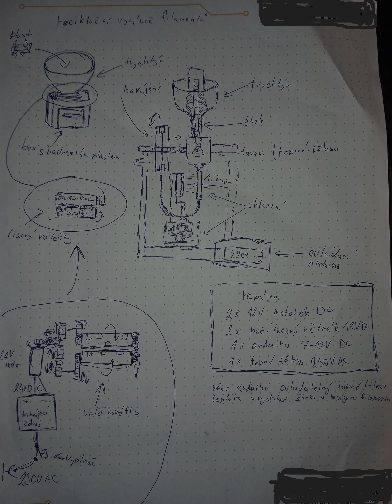

# Školní-projekt
__Dobrý den 👋, Vypracoval: Adam Franc__  
 
1.[První pololetí](#prvn%C3%AD-pololet%C3%AD-20122024) 
-1.1[Projekt](#projekt) 
--1.1.1[Fotky](#fotky) 
--1.1.2[Video](#video) 
--1.1.3[Popis](#popis) 
-1.2[Cíl projektu](#c%C3%ADl-projektu) 
-1.3[Můj pohled na projekt](#m%C5%AFj-pohled-na-projekt) 
2.[Druhé pololetí](#druh%C3%A9-pololet%C3%AD-1652025) 
3.[Citace](#citace) 
 
## První pololetí 20.12.2024
V prvníp pololetí jsem se rozhodl naučit se v programech a připravit si vše potřebné pro uskutečnění mého projektu.
### Projekt📁
Jako projekt jsem si vybral a vymyslel: __Reciklační vyráběčku filamentu__
#### Fotky📷
Zde jsem si nakreslil plánek.

#### Video📽
Zde je video s krátkou ukázkou toho co mám připravéného.
#### Popis📝
Funguje na principu šneka, který protlačí nadrcený plast skrze topné těleso, z něhož bude vytékat filamet, který se bude následně chladit a namotávat.
### Cíl projektu🎯
Projekt by měl být na konci schopný rozdrtit plasty a ty pak spátky přetavit na filament, který by se měl namotat na špulku. 
+ Naprogramované arduiono s ukazatelem teploty.
### Můj pohled na projekt👌
Tenhle projekt jsem si vybral hlavně protože mám 3D tiskárnu a nechci vyhazovat zbytečně plast.
## Druhé pololetí 16.5.2025
## Citace

