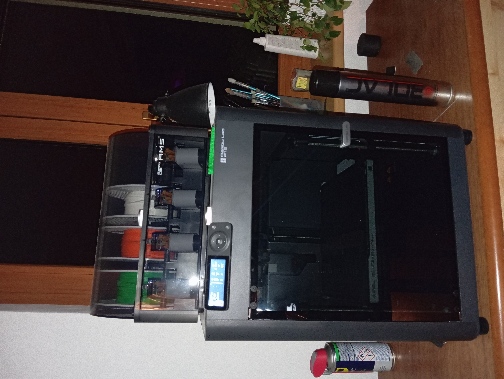

# Školní-projekt
__Dobrý den 👋, Vypracoval: Adam Franc__  
 
1.[První pololetí](#prvn%C3%AD-pololet%C3%AD-20122024) 
-1.1[Projekt](#projekt) 
--1.1.1[Fotky](#fotky) 
--1.1.2[Video](#video) 
--1.1.3[Popis](#popis) 
-1.2[Cíl projektu](#c%C3%ADl-projektu) 
-1.3[Můj pohled na projekt](#m%C5%AFj-pohled-na-projekt) 
2.[Druhé pololetí](#druh%C3%A9-pololet%C3%AD-1652025) 
3.[Zdroje](#zdroje) 
 
## První pololetí 20.12.2024
V prvníp pololetí jsem se rozhodl naučit se v programech a připravit si vše potřebné pro uskutečnění mého projektu.
### Projekt📁
Jako projekt jsem si vybral a vymyslel: __Reciklační vyráběčku filamentu__ 
 
__Tady je program na arduino aby ukazovalo telotu čidla__
<pre>
<code id="code-block">
#include <Wire.h>
#include <LiquidCrystal_I2C.h>

// Inicializace LCD displeje s I2C adresou 0x27 (může se lišit)
LiquidCrystal_I2C lcd(0x27, 16, 2);

// Pin, na který je připojeno teplotní čidlo
const int tempPin = A0;

void setup() {
  // Nastavení LCD displeje
  lcd.init();
  lcd.backlight();
  lcd.print("Teplota:");
}

void loop() {
  // Čtení hodnoty z teplotního čidla
  int tempReading = analogRead(tempPin);

  // Převod hodnoty na teplotu ve stupních Celsia
  float voltage = tempReading * 5.0 / 1024.0;
  float temperatureC = voltage * 100;

  // Zobrazení teploty na LCD displeji
  lcd.setCursor(0, 1);
  lcd.print(temperatureC);
  lcd.print(" C");

  // Krátká pauza před dalším měřením
  delay(1000);
}
</code>
<button onclick="copyToClipboard()">Můžete si kód klidně zkopírovat a zkusit.</button>
</pre>
#### Fotky📷
Zde jsem si nakreslil __plánek__.
 

 
 
Tady je __výstřižek z Fusionu__ jak si rýsuju součástky na výrobu.
 

Tady je __3D tiskárna__ na ktersi tisknu dílky.

A tady mám nějaké __součástky__ na ten projekt.

#### Video📽
Zde je část mého programu kde zapojuju a testuju __Arduino__ aby ukazovalo teplotu.
[Sledujte video na Google Drive](https://drive.google.com/file/d/1dde__meeCsf8Jv0vqH-MyN_2luJrceo_/view?usp=sharing)
#### Popis📝
Funguje na principu šneka, který protlačí nadrcený plast skrze topné těleso, z něhož bude vytékat filamet, který se bude následně chladit a namotávat.
Při tvorbě používám programi Fusion 360, GitHub, Bambulab studio, Arduino IDE.
### Cíl projektu🎯
Projekt by měl být na konci schopný rozdrtit plasty a ty pak spátky přetavit na filament, který by se měl namotat na špulku. 
+ Naprogramované arduiono s ukazatelem teploty.
### Můj pohled na projekt👌
Tenhle projekt jsem si vybral hlavně protože mám 3D tiskárnu a nechci vyhazovat zbytečně plast. Projekt je za mě docela složitý a zatím nemám všechny komponenty, abych ho molh začít stavět, proto jsem se během schánění součástí v tomhle pololetí učil hlavně s těmi programi.
## Druhé pololetí 16.5.2025
## Zdroje

